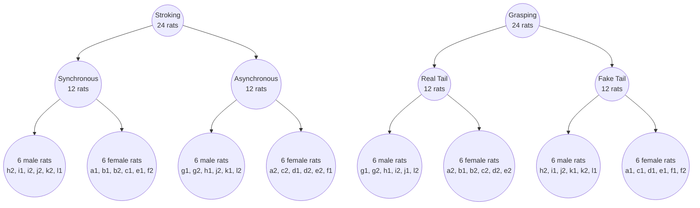

# Conditions by sex

```mermaid
flowchart TD

a((Stroking \n 24 rats)) --> b((Synchronous \n 12 rats))
a((Stroking \n 24 rats)) --> c((Asynchronous \n 12 rats))
b((Synchronous \n 12 rats)) --> d((6 male rats \n h2, i1, i2, j2, k2, l1))
b((Synchronous \n 12 rats)) --> e((6 female rats \n a1, b1, b2, c1, e1, f2))
c((Asynchronous \n 12 rats)) --> f((6 male rats \n g1, g2, h1, j2, k1, l2))
c((Asynchronous \n 12 rats)) --> g((6 female rats \n a2, c2, d1, d2, e2, f1))

h((Grasping \n 24 rats)) --> i((Real Tail \n 12 rats))
h((Grasping \n 24 rats)) --> j((Fake Tail \n 12 rats))
i((Real Tail \n 12 rats)) --> k((6 male rats \n g1, g2, h1, i2, j1, l2))
i((Real Tail \n 12 rats)) --> l((6 female rats \n a2, b1, b2, c2, d2, e2))
j((Fake Tail \n 12 rats)) --> m((6 male rats \n h2, i1, j2, k1, k2, l1))
j((Fake Tail \n 12 rats)) --> n((6 female rats \n a1, c1, d1, e1, f1, f2))
```
