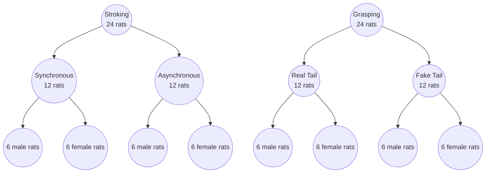

# Conditions by sex

```mermaid
flowchart TD

a((Stroking \n 24 rats)) --> b((Synchronous \n 12 rats))
a((Stroking \n 24 rats)) --> c((Asynchronous \n 12 rats))
b((Synchronous \n 12 rats)) --> d((6 male rats))
b((Synchronous \n 12 rats)) --> e((6 female rats))
c((Asynchronous \n 12 rats)) --> f((6 male rats))
c((Asynchronous \n 12 rats)) --> g((6 female rats))

h((Grasping \n 24 rats)) --> i((Real Tail \n 12 rats))
h((Grasping \n 24 rats)) --> j((Fake Tail \n 12 rats))
i((Real Tail \n 12 rats)) --> k((6 male rats))
i((Real Tail \n 12 rats)) --> l((6 female rats))
j((Fake Tail \n 12 rats)) --> m((6 male rats))
j((Fake Tail \n 12 rats)) --> n((6 female rats))
```
