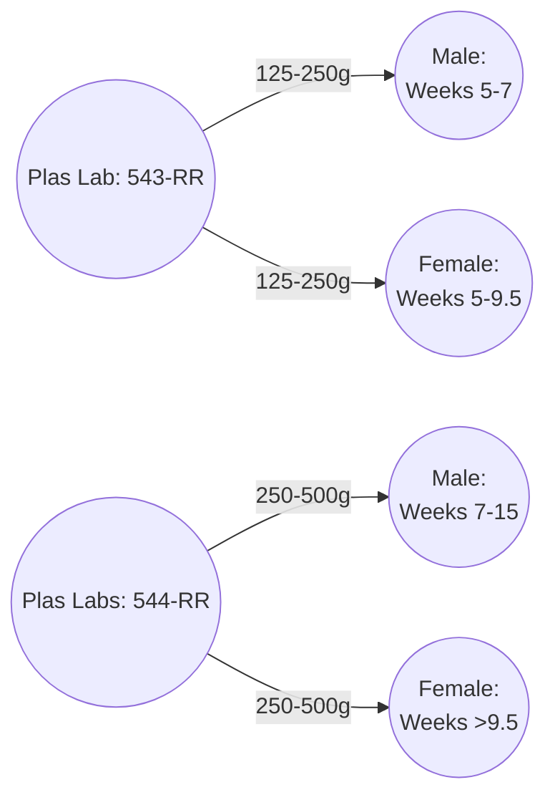

---
# Restrainer by mass

```mermaid
flowchart LR
A((Plas Lab: 543-RR)) -->|125-250g| C((Male: \n Weeks 5-7))
A((Plas Lab: 543-RR)) -->|125-250g| D((Female: \n Weeks 5-9.5))
		
B((Plas Labs: 544-RR)) -->|250-500g| E((Male: \n Weeks 7-15))
B((Plas Labs: 544-RR)) -->|250-500g| F((Female: \n Weeks >9.5))
```
